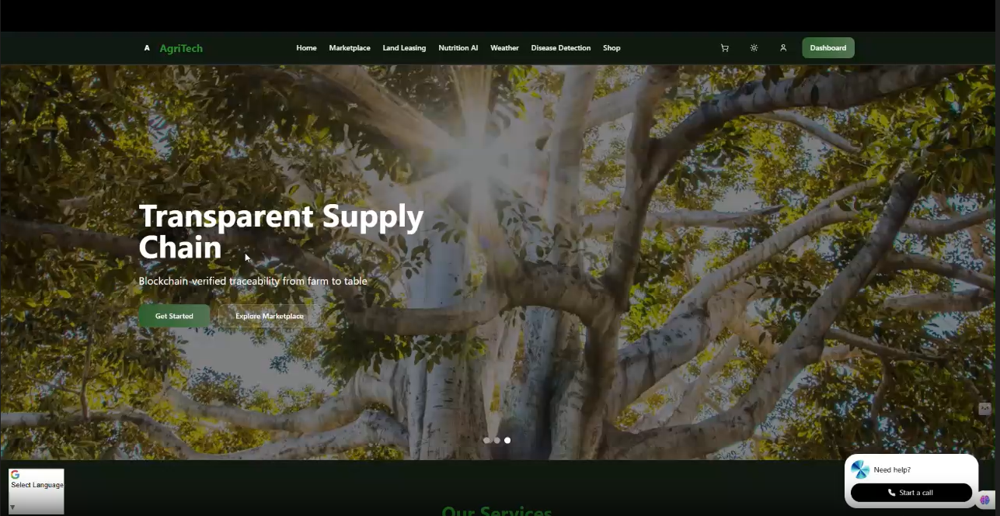

# 🌾 AgriTech — Team Saraswati



**Connecting Farmers, Customers, and Landowners for a Smarter Agricultural Future**

---

## 🎥 Demo

Experience AgriTech in action:

The demo video is available in the project directory as `AgriTech -- Team Saraswati.mp4`. Click on the file to watch the video locally.

---

## 🌟 Core Features

- **Direct Marketplace**  
  Buy fresh produce directly from farmers, ensuring better prices for both customers and growers. Transparent listings, secure transactions, and real-time availability.

- **Plant Disease Detection**  
  Instantly identify plant diseases by uploading images. Get actionable advice and treatment recommendations powered by AI.

- **Land Leasing Platform**  
  Farmers can browse available lands for rent, view landlord details, pricing per acre, and lease terms. Landowners can list properties and connect with interested farmers.

- **AI Chatbot for Diet & Queries**  
  Customers can chat with our AI assistant for personalized diet planning and get answers to nutrition-related questions.

- **7-Day Weather Forecast & Recommendations**  
  Access accurate, localized weather forecasts for the week. Receive tailored farming recommendations based on upcoming weather patterns.

- **Crop Recommendation Based on Soil Health**  
  Get crop suggestions based on soil nutrient levels (e.g., Nitrogen, Oxygen, etc.), helping maximize yield and sustainability.

- **Blockchain-Based Food Traceability**  
  *(Under Development)*  
  Track the journey of food from farm to consumer using blockchain technology, ensuring transparency and safety in the supply chain.

---

## 🚧 Blockchain Feature — Contributors Welcome!

Our **Blockchain-Based Food Traceability** module is currently under development.  
If you are interested in blockchain technology and want to help us build a transparent, secure food supply chain, **we welcome your contributions!**

---

## 🛠️ Tech Stack

- **Frontend:** Next.js, TypeScript, Material-UI, React Query  
- **Backend:** Node.js, Express, PostgreSQL, Redis  
- **AI/ML:** Python, TensorFlow, Scikit-learn  
- **Integrations:** Weather APIs, Market Data APIs  
- **Blockchain:** Food traceability module (in progress)

---

## 📁 Project Structure

````plaintext
src/
├── components/   # UI building blocks
├── pages/        # Application routes
├── services/     # API and business logic
├── models/       # Data schemas
├── utils/        # Helper functions
├── styles/       # Theme and global styles
└── config/       # App configuration
````

---

## 🚀 Quick Start

1. **Clone the repo**
   ```bash
   git clone https://github.com/Jayanth-0703/AgriTech---Team-Saraswati.git
   cd AgriTech---Team-Saraswati
   ```

2. **Install dependencies**
   ```bash
   npm install
   ```

3. **Configure environment**
   ```bash
   cp .env.example .env
   # Edit .env as needed
   ```

4. **Start the app**
   ```bash
   npm run dev
   ```

---

## 🤝 Contributing

We welcome your ideas and code!  
See our contribution guidelines to get started.

---

## 📜 License

MIT — see [`LICENSE`](LICENSE ) for details.

---

## 👥 Team

- **Project Lead:** Karthikeya
- **UI/UX Designers**  Harsha , Abhinav
- **Backend Developers**  Harsha , Jayanth
- **AI/ML Researchers** Karthikeya , Jayanth

---

## 🙏 Acknowledgments

- Agricultural experts & partners  
- Data providers  
- The farming community

---

> **AgriTech — Empowering agriculture, enriching lives.**
> 

> **AgriTech — From Soil to Plate.**
